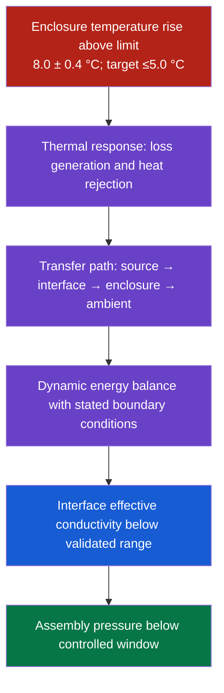

# Diagnose Hardware Root Causes

## Purpose

Turn a vague hardware-performance concern into a testable causal model, prioritized root-cause hypotheses, validation experiments and engineering questions. Preserve the source's mechanical, materials, electrical and manufacturing viewpoints without pretending that four independent agents or specialists are present.

This is a diagnostic workflow, not proof of causation. Mark every proposed cause as observed, calculated, experimentally supported, contradicted or untested.

## Use when

- a measured hardware parameter misses a requirement;
- the user asks for root-cause analysis, a causal tree or 5 Whys;
- thermal, structural, acoustic, electrical, EMC, materials or manufacturing mechanisms interact;
- teams need a multidisciplinary review and experiment plan;
- parameter improvements create engineering contradictions.

Do not use the tree alone for safety certification, failure-investigation sign-off or regulatory conclusions. Escalate safety-critical work to qualified engineers and applicable procedures.

## Operating principles

| Principle | Rule |
|---|---|
| Measurable problem | Define response, target, actual value, uncertainty, conditions and boundary before diagnosis. |
| Causal language | Nodes name states or mechanisms precisely; edges state the proposed causal relation. |
| Physical grounding | Start with conservation laws, transfer paths and governing equations where applicable. |
| Evidence over depth | Expand until hypotheses are testable and decision-relevant; never manufacture seven levels to meet a quota. |
| Multidisciplinary coverage | Review mechanical, materials, electrical/control, manufacturing/quality and measurement/environment perspectives as relevant. |
| Explicit uncertainty | Retain competing hypotheses and disagreement; do not turn votes into causal probabilities. |
| Validation | A “root cause” requires an intervention or discriminating test, not only a plausible story. |

## Intake and problem contract

Capture:

1. response variable and engineering meaning;
2. requirement, tolerance and source;
3. observed values, distribution, sample size and uncertainty;
4. units, instrument, calibration and data-processing method;
5. operating state, duty cycle, environment and configuration;
6. when/where the problem occurs and a comparison population;
7. hardware revision, materials, suppliers, process lots and software/firmware versions;
8. safety, cost, schedule and non-changeable constraints;
9. previous tests, changes and known-good/known-bad samples.

Example:

> During a defined charging profile at 25 °C ambient, enclosure surface temperature rise is 8.0 ± 0.4 °C (calibrated IR method, emissivity documented, n=10) against a ≤5.0 °C requirement.

If essential data are missing, provide a provisional tree and a data-acquisition plan. Do not invent measurements.

## Two-level workflow

```text
Multidisciplinary review
  └─ each relevant discipline applies the same diagnostic method
       ├─ define the response
       ├─ model physical mechanisms
       ├─ decompose parameters
       ├─ broaden with 5M1E
       ├─ classify evidence and endpoints
       ├─ design discriminating tests
       └─ prioritize validated/actionable causes
```

The “roles” are review lenses, not simulated credentials:

| Review lens | Typical questions |
|---|---|
| Mechanical | Geometry, tolerance stack, contact, load path, vibration, fluid path, assembly |
| Materials | Bulk/interface properties, degradation, variability, compatibility, failure modes |
| Electrical/control | Power loss, signal integrity, control state, EMC, sensors, firmware interaction |
| Manufacturing/quality | Process window, equipment capability, supplier/lot variation, inspection and rework |
| Measurement/environment | Calibration, fixture, sampling, repeatability, environmental and operator effects |

State which lenses were not reviewed and why. A real domain expert must review unfamiliar or safety-critical branches.

## Seven-stage diagnostic method

### Stage 1 — Parameterize the target

Write the problem as:

```text
response + target/tolerance + actual distribution + method/uncertainty + operating conditions + boundary
```

Separate specification nonconformance from desired optimization. Confirm whether the requirement and measurement method are comparable.

### Stage 1.5 — First-principles model

Build three linked views:

1. **Phenomenon definition** — what physical response is being measured?
2. **Transfer path** — how do energy, force, mass, charge, information or error propagate?
3. **Governing relationships** — equations, conservation balances or validated empirical models and their assumptions.

Principle nodes contain neutral physics, not defects. They may form a chain or multiple parallel mechanism branches. The exporter requires every root child to be a `principle` node to preserve the source convention, but this is a visualization rule: the actual causal order must be encoded through child relationships and edge labels, not inferred from color.

Example thermal relationships:

```text
P_loss = electrical/chemical loss terms
ΔT(t) = dynamic thermal response(P_loss, thermal capacitance, heat-transfer paths)
R_path = conduction + interface + convection/radiation terms under stated assumptions
```

Do not use `ΔT = Q × Rth` without defining steady/transient conditions, units and whether `Q` means heat rate or energy.

### Stage 2 — Select governing equations

For each mechanism list:

- equation/model and source;
- variables and units;
- assumptions and applicability domain;
- measured versus inferred inputs;
- sensitivity of the response;
- interactions or confounding variables.

Examples such as beam deflection are prompts only; choose boundary conditions and load cases that match the hardware.

### Stage 3 — Recursively decompose parameters

For each influential parameter ask:

- What determines this parameter?
- Which upstream states could move it in the observed direction?
- What evidence supports or contradicts that edge?
- Can it be measured or perturbed independently?
- Is it a cause, mediator, correlate or measurement artifact?

Stop a branch when it reaches a testable controllable factor, a defined contradiction/tradeoff, a verified boundary, or a low-value hypothesis. Record why it stops. Depth is determined by diagnosability, not a fixed count.

### Stage 4 — Broaden with 5M1E

When equations do not cover process and observation variability, check:

- **Machine/equipment**;
- **Material**;
- **Method/process**;
- **Measurement**;
- **People/human factors**;
- **Environment**.

The source's machine-material-method-environment-measurement set is retained and expanded with people where human execution can affect the result. Categories are completeness prompts, not proof and not mandatory when irrelevant.

### Stage 5 — Classify branch endpoints

| Endpoint | Meaning | Required next step |
|---|---|---|
| `key` | Controllable, measurable causal hypothesis | Define intervention and predicted response |
| `contradiction` | Improving one parameter plausibly degrades another | State both parameters, relationship and acceptable trade space |
| `end` | Verified physical, regulatory or project boundary | Cite boundary and test whether redesign can move it |
| `dispute` | Reviewers disagree or evidence conflicts | Record positions and a discriminating test |

“SOP missing,” “inspection missing” or “operator error” is not automatically terminal. Continue to the specific parameter distribution, mechanism and evidence. Conversely, do not force a deeper chain when the remaining question is outside scope or immaterial—record that boundary transparently.

### Stage 6 — Rank causal hypotheses

Do not select green nodes merely because they are adjustable. Rank using:

- observed association with the response;
- mechanistic plausibility and model sensitivity;
- temporal/order consistency;
- repeatability across units/lots/conditions;
- strength of counterevidence;
- ability of a test to discriminate alternatives;
- intervention effect and reversibility;
- feasibility, safety and decision value.

Label confidence as provisional, supported or validated with an explanation. Never convert a 1–5 team vote into a percentage contribution. Voting may prioritize investigation effort only.

### Stage 7 — Define experiments and engineering questions

Convert each priority hypothesis into:

```text
How can we change or control [factor] from [current state] to [test state]
to achieve [response target] under [conditions], while maintaining [constraints]?
```

For each test include hypothesis, manipulation, controls, samples/replicates, randomization/blinding where useful, measurement system, predicted result, alternative result, acceptance criterion, safety stop and analysis method. Prefer tests that distinguish multiple competing branches.

## Multidisciplinary review sequence

### Review 0 — Shared problem definition

All relevant lenses agree on the measurable problem, model boundary and known evidence. Record unresolved disagreements.

### Review 0.5 — Shared physical model

Review transfer paths, equations, assumptions, system boundary and interactions. Neutral principle nodes precede defect hypotheses in the causal representation.

### Review 1 — Independent lens review

Apply Stages 2–6 from each relevant lens. Independence means separate reasoning passes, not invented named experts. Ask for an actual specialist when knowledge is insufficient.

### Review 2 — Cross-review

Reconcile terminology, units and duplicate states. Preserve physically distinct causes even when labels look similar. Identify shared causes, mediators and interactions.

### Review 3 — Disagreement and evidence plan

Record each disputed hypothesis, evidence for/against, consequences of being wrong and discriminating test. If using scores, define the rubric and use them only to order work.

### Review 4 — Merge

Merge nodes only when the physical variable, direction, conditions and mechanism match. Preserve the deepest useful evidence-backed path, but keep complementary branches and provenance.

## Node and edge schema

Each node should carry:

- stable unique `id`;
- concise `label` describing one state or principle;
- `type`: `root`, `principle`, `mid`, `key`, `dispute`, `contradiction` or `end`;
- parameter, direction, unit and conditions when applicable;
- evidence status and IDs;
- discipline/lens provenance;
- test or stopping rationale for endpoints.

Avoid causal prose inside a state label. Put the causal assertion on the edge or in metadata.

Poor: `Low TIM conductivity causes high thermal resistance`  
Better node: `TIM effective through-plane conductivity < specified range under assembled pressure`

## Mermaid output



Use accessible labels and do not rely on color alone. Include a text/table equivalent.

## PNG export

Create a UTF-8 JSON tree with a top-level `root` object and run:

```text
python scripts/ceae_tree_export.py --input causal-tree.json --output causal-tree.png
```

The exporter validates the tree, unique IDs, permitted node types, root type, first-layer principle convention, output suffix and safe overwrite behavior. It exports a static scientific-style PNG with a legend. Review the PNG for clipping and legibility; very large trees should be split into overview and branch figures.

## Output structure

1. measurable problem and boundary;
2. measurement-system and data-quality assessment;
3. first-principles model and assumptions;
4. multidisciplinary lens summaries;
5. merged causal tree and evidence table;
6. disagreements and counterevidence;
7. prioritized hypotheses;
8. validation experiment plan;
9. engineering questions, owners and next decision.

## MCP use

No MCP is required for the diagnostic method or local PNG export. Use external evidence tools only when the user requests research and the service is actually available. Do not imply that Patsnap authorization is necessary for analyzing supplied engineering data.

## Quality gates

- [ ] Requirement and observed data use comparable methods and conditions.
- [ ] Units, uncertainty, sample size and measurement-system risk are visible.
- [ ] Governing models state assumptions and applicability.
- [ ] Every causal edge is evidence-labeled or explicitly hypothetical.
- [ ] Relevant multidisciplinary and 5M1E lenses were checked.
- [ ] Tree depth follows diagnostic value, not a quota.
- [ ] Adjustable factors are not automatically called root causes.
- [ ] Contradictions name both parameters and trade space.
- [ ] Votes do not masquerade as causal weights.
- [ ] Priority hypotheses have discriminating tests.
- [ ] Safety-critical conclusions receive qualified review.
- [ ] Mermaid, JSON, PNG and evidence table are consistent.
