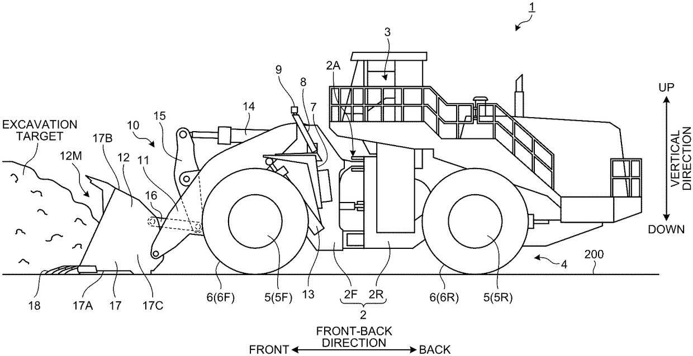

# Historical fixture: dump-truck patent briefing (publications from February–March 2026)

> Generated: 2026-04-16 15:26

> Fixture notice: This localized example preserves the source report’s retrieved records for migration and renderer testing. It is not current intelligence. The original literature query produced substantial semantic noise; the records below must not be treated as a validated literature review.

## Part 1: Recently published patent overview

- **Query:** `ANCS:(Komatsu Ltd. OR Mitsubishi Heavy Industries OR XCMG Construction Machinery) AND MIPC:(E02F) AND PBD:[20260201 TO 20260330] AND TAC_ALL:(dump truck)`
- **Returned records:** 1
- **Counting unit:** Returned patent publications in the historical fixture
- **Data cut-off:** 2026-03-30

| Company or applicant group | Record count |
|---|---:|
| All applicants | 1 |

## Part 2: Company technology summaries

### All applicants (1 records)

- **Leading observed topics:** Imaging (1)
- **Representative technical approach:** The monitoring system uses first and second imaging devices to capture the work equipment and ground from defined viewpoints, then applies defect- and boulder-detection units to identify hazards.
- **Evidence limitation:** One publication is not sufficient to characterize a competitor portfolio or technology trend.

## Part 3: Patent details

### All applicants (1 records)

#### Imaging (1 records)

##### [US20260071412A1](https://analytics.patsnap.com/patent-view/abst?patentId=a9a494dc-9fc6-44b6-8582-13f89e8fa099)

- **Title:** Work machine monitoring system and work machine monitoring method
- **Legal status:** Pending substantive examination in the historical source; reverify before use
- **Original applicant:** KOMATSU LTD.
- **Application date:** 2023-02-03
- **Publication date:** 2026-03-12
- **Technical problem:** Changes in work content and operating conditions can expose a work machine to damage; real-time monitoring may support prevention or earlier detection.
- **Technical approach:** First and second imaging devices capture work equipment and the ground from defined viewpoints, while defect- and boulder-detection units identify the respective conditions.
- **Technical benefit:** The disclosed monitoring approach is intended to detect defects and potential hazards earlier and reduce damage risk.
- **Abstract drawing:** 
- **Figure provenance:** Patent drawing preserved unchanged from the frozen source fixture; verify the official patent record before reuse.

## Part 4: Related literature

- **Derived literature query:** `title:(dump truck OR dumper OR tipper)`
- **Matching literature records:** 1455; showing 20
- **Quality warning:** The historical query is overbroad. It retrieves unrelated uses of “tipper,” “dumper,” and “dump,” including web accessibility, addiction, waste enforcement, laser systems, and geophysics. Use the list to test noise handling, not to support a dump-truck technology conclusion.

### 1. Tipper

- **Authors:** Dai, Yibo; Karalis, George; Kawas, Saba; Olsen, Chris
- **Publication:** Proceedings of the 33rd Annual ACM Conference Extended Abstracts on Human Factors in Computing Systems, 2015, pp. 1773–1778
- **DOI:** [10.1145/2702613.2732796](https://doi.org/10.1145/2702613.2732796)
- **Citation context:** cited by 4 literature records; cited by 10 patent records
- **Abstract:** Most senior citizens in the U.S. use the Internet regularly but can encounter basic issues they cannot solve themselves. The researchers used contextual inquiry and an online survey to study these difficulties, then designed Tipper, a browser-based contextual-help system. This record is unrelated to dump-truck technology and is a false positive caused by lexical ambiguity.

### 2. Dumping Car

- **Publication:** Scientific American, 1885, vol. 19 (475 supplement), p. 7578
- **DOI:** [10.1038/scientificamerican02071885-7578asupp](https://doi.org/10.1038/scientificamerican02071885-7578asupp)
- **Relevance note:** Potential historical vehicle context; no abstract was available in the source fixture.

### 3. Dumping Car

- **Publication:** Scientific American, 1884, vol. 51 (14), p. 210
- **DOI:** [10.1038/scientificamerican10041884-210c](https://doi.org/10.1038/scientificamerican10041884-210c)
- **Relevance note:** Potential historical vehicle context; no abstract was available in the source fixture.

### 4. dumper

- **Publication:** Dictionary of Gems and Gemology, p. 286
- **DOI:** [10.1007/978-3-540-72816-0_7004](https://doi.org/10.1007/978-3-540-72816-0_7004)
- **Relevance note:** Unrelated lexical false positive.

### 5. Dumping Car

- **Publication:** Scientific American, 1885, vol. 1 (2 build), p. 47
- **DOI:** [10.1038/scientificamerican12011885-47bbuild](https://doi.org/10.1038/scientificamerican12011885-47bbuild)
- **Relevance note:** Potential historical vehicle context; no abstract was available in the source fixture.

### 6. Tipper Gore

- **Publication:** East Tennessee Newsmakers, 2024, pp. 44–47
- **DOI:** [10.2307/jj.28697809.14](https://doi.org/10.2307/jj.28697809.14)
- **Relevance note:** Unrelated person-name false positive.

### 7. Dumping Car

- **Publication:** Scientific American, 1885, vol. 53 (21), p. 323
- **DOI:** [10.1038/scientificamerican11211885-323b](https://doi.org/10.1038/scientificamerican11211885-323b)
- **Relevance note:** Potential historical vehicle context; no abstract was available in the source fixture.

### 8. Dumper derailment investigation and development of custom check rail

- **Authors:** Lindsay Dobson
- **Abstract:** Rio Tinto Iron Ore operates a large private rail network serving multiple mine sites. Wagons are unloaded through rotary car dumpers. Repeated derailments occurred at the outgoing side of dumpers at Parker Point. The work assessed site conditions, applicable standards, root causes, and why an earlier passive check-rail mitigation did not operate as intended.
- **Relevance note:** Relevant to rotary rail-car dumpers, not directly to off-highway dump-truck patents.

### 9. Dumper Truck Racing

- **Authors:** Joe Gates
- **Relevance note:** Insufficient bibliographic and abstract evidence in the fixture.

### 10. Dump Truck Permit

- **Authors:** pTools
- **Relevance note:** Likely regulatory or application content rather than technical literature; verify before inclusion.

### 11. New Dump Car

- **Publication:** Scientific American, 1880, vol. 42 (20), pp. 306–307
- **DOI:** [10.1038/scientificamerican05151880-306a](https://doi.org/10.1038/scientificamerican05151880-306a)
- **Relevance note:** Potential historical vehicle context; no abstract was available in the source fixture.

### 12. South Side of Highway Dump

- **Authors:** Dallas (Tex.)
- **Abstract:** Photograph of the south side of a washout dump along Highway 10, facing west at 11:40 a.m.
- **Relevance note:** Unrelated place/photograph false positive.

### 13. The Research of Cavity Dumper Driver

- **Authors:** Sheng Cuixia
- **Publication:** Journal of Changchun Institute of Optics and Fine Mechanics, 2004
- **Abstract:** The work describes a cavity-dumper driver for an acousto-optic cell that produces laser-pulse signals at multiple repetition rates.
- **Relevance note:** Unrelated laser-system false positive caused by the term “dumper.”

### 14. D. Kipper & S. Whitney. The Addiction Solution: Unraveling the Mysteries of Addiction through Cutting-Edge Brain Science

- **Authors:** James P. Foster
- **Publication:** Alcoholism Treatment Quarterly, 2013, vol. 31 (1), pp. 161–163
- **DOI:** [10.1080/07347324.2013.746614](https://doi.org/10.1080/07347324.2013.746614)
- **Relevance note:** Unrelated false positive.

### 15. Improved Dumping Wagon

- **Publication:** Scientific American, 1874, vol. 31 (8), p. 118
- **DOI:** [10.1038/scientificamerican08221874-118a](https://doi.org/10.1038/scientificamerican08221874-118a)
- **Relevance note:** Potential historical wagon context; no abstract was available in the source fixture.

### 16. Dump Trucks — Big or Bigger

- **Authors:** Larry Goode
- **Abstract:** The Indiana Department of Highways formed a cross-functional committee to assess whether tandem dump trucks should be removed from its fleet. The team reviewed work records, programs, calendars, costs, and operational value.
- **Relevance note:** Relevant to fleet operations and economics, not patent technology.

### 17. Passerby helps prosecute fly-tipper

- **Authors:** Alison Falconer
- **Relevance note:** Unrelated illegal-waste-disposal false positive.

### 18. Fly tipper prosecuted

- **Authors:** Ceri Davis
- **Relevance note:** Unrelated illegal-waste-disposal false positive.

### 19. Dumpers foiled

- **Publication:** Marine Pollution Bulletin, 1971, vol. 2 (8), p. 115
- **DOI:** [10.1016/0025-326x(71)90249-9](https://doi.org/10.1016/0025-326x(71)90249-9)
- **Relevance note:** Unrelated waste-disposal false positive.

### 20. Research on the character of tipper data

- **Authors:** Pan We
- **Abstract:** Two-dimensional magnetotelluric forward simulations were used to examine tipper components for models with horizontal electrical interfaces. The work summarizes response anomalies and provides a basis for interpreting measured magnetotelluric tipper data.
- **Relevance note:** Unrelated geophysics false positive caused by the term “tipper.”

### AI-assisted literature synthesis

The historical literature result set is not suitable for technology synthesis because most retrieved records are lexical false positives. Of the 20 displayed records, only a small subset concerns dumping vehicles, rail-car dumpers, or dump-truck operations, and those records span 1874–2016 with different technical purposes. Before using literature evidence, narrow the query with vehicle, mining, earthmoving, haulage, hydraulic-bed, chassis, braking, payload, or work-machine concepts; exclude person names, waste enforcement, lasers, and magnetotelluric terminology; then review precision and recall manually.

#### Record-level disposition

- **[1]** Exclude: web-accessibility system named Tipper.
- **[2]** Review historical relevance: dumping car; no abstract.
- **[3]** Review historical relevance: dumping car; no abstract.
- **[4]** Exclude: gemology dictionary entry.
- **[5]** Review historical relevance: dumping car; no abstract.
- **[6]** Exclude: person-name match.
- **[7]** Review historical relevance: dumping car; no abstract.
- **[8]** Retain for adjacent rail-car-dumper reliability context.
- **[9]** Insufficient evidence.
- **[10]** Verify; likely nontechnical permit content.
- **[11]** Review historical relevance: dump car; no abstract.
- **[12]** Exclude: location photograph.
- **[13]** Exclude: laser cavity-dumper system.
- **[14]** Exclude: addiction book review.
- **[15]** Review historical relevance: dumping wagon; no abstract.
- **[16]** Retain for adjacent fleet economics and operations.
- **[17]** Exclude: illegal waste disposal.
- **[18]** Exclude: illegal waste disposal.
- **[19]** Exclude: marine waste disposal.
- **[20]** Exclude: magnetotelluric tipper data.

## Fixture limitations

- The patent legal status is historical and must be reverified.
- The patent count reflects a single returned record, not a complete family landscape.
- The literature query has low precision and is intentionally retained as a negative test case.
- Citation counts are historical source values and are not quality or relevance scores.
- No conclusion in this fixture should be reused without a current search.
